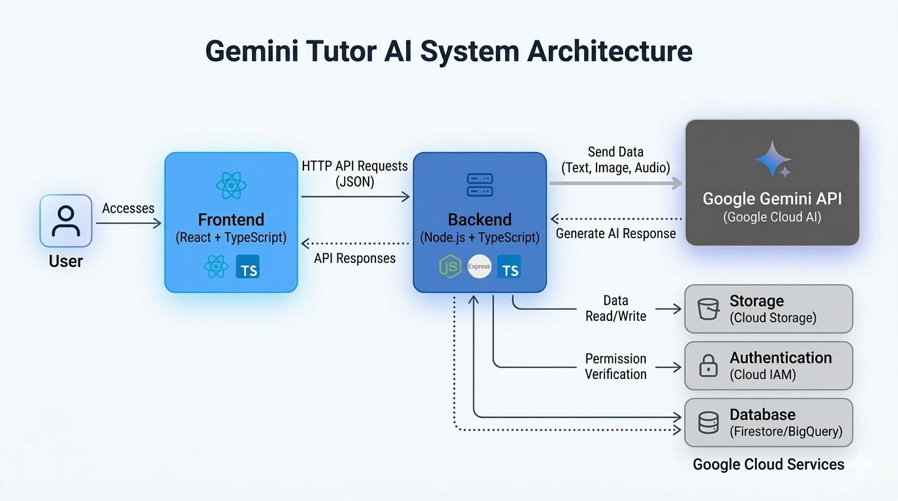

# Ngola Tutor AI

An AI-powered homework assistant — point your camera, use your voice, or type to learn interactively with an AI tutor built on Google Gemini.

     

---

## Architecture



---


## English

### Overview

Ngola Tutor is a full-stack web application that acts as a patient AI tutor. It helps students understand problems step by step, without giving direct answers — encouraging them to discover solutions on their own. Features include:

- **3-Column Educational Workspace** — specialized layout with Camera (Left), Interactive Whiteboard (Center), and Chat (Right)
- **Interactive Whiteboard** — central stage for real-time visual explanations and AI-driven diagrams
- **Camera Vision** — point your camera at your homework and get guidance
- **Sign Language Avatar** — pedagogical avatar with gestures for deaf/mute accessibility
- **Voice Chat** — talk to the tutor using your microphone
- **Text Chat** — focused side-panel conversation with image upload support
- **AI Illustrations** — automatic AI-generated diagrams for visual topics
- **Multilingual** — responds in the same language the student uses
- **Dark / Light Theme** — toggle between dark and light mode for the entire interface
- **Language Switcher (EN/PT)** — full interface support for English and Portuguese
- **Landing Page** — professional marketing page with features, case studies, and about sections


### Tech Stack

| Layer     | Technology                                                                 |
|-----------|----------------------------------------------------------------------------|
| Frontend  | React 19, Vite 6, Tailwind CSS 4, Lucide Icons, Motion                      |
| Backend   | Node.js, Express 4, TypeScript, tsx                                         |
| AI        | Google Gemini (`gemini-2.5-flash-image-preview`) via Vertex AI or `@google/genai` |
| Deploy    | Docker, Google Cloud Run, Cloud Build                                       |


### Project Structure

```text
Gemini-Tutor-AI/
├── src/
│   ├── App.tsx              # Main app (Welcome screen, Chat, Camera, Voice)
│   ├── LandingPage.tsx      # Landing page (dark/light theme, EN/PT i18n)
│   ├── i18n.ts              # Internationalization translations (EN/PT)
│   ├── main.tsx             # React entry point
│   └── index.css            # Global styles (Tailwind)
├── server/
│   ├── index.ts             # Express server (API routes + static serving)
│   ├── package.json
│   └── tsconfig.json
├── docs/
│   └── Novas_Ideias.txt     # Future update planning document
├── package.json             # Frontend dependencies & scripts
├── vite.config.ts           # Vite configuration
├── tsconfig.json            # Frontend TypeScript config
├── Dockerfile               # Multi-stage build (frontend + backend)
├── deploy.sh                # One-command deploy to Google Cloud Run
├── LICENSE                  # MIT License
├── CONTRIBUTORS.md          # Project contributors
└── README.md
```


### Prerequisites

- Node.js 18+
- npm 9+
- A Gemini API key ([get one here](https://aistudio.google.com/apikey)) **or** a Google Cloud project with Vertex AI enabled


### Installation

```bash
# Clone the repository
git clone <your-repo-url>
cd Gemini-Tutor-AI

# Install frontend dependencies
npm install

# Install backend dependencies
cd server
npm install
```


### Environment Variables


Create a `.env` file in the project root:

```env
# Option A: Local development with API key
GEMINI_API_KEY=your_gemini_api_key_here

# Option B: Google Cloud Vertex AI (used when deployed)
GOOGLE_CLOUD_PROJECT=your_project_id
GOOGLE_CLOUD_LOCATION=us-central1
```


> The backend tries Vertex AI first (if `GOOGLE_CLOUD_PROJECT` is set), otherwise falls back to the API key.


### Run in Development


Open two terminals:

```bash
# Terminal 1 — Frontend (Vite dev server on port 3000)
npm run dev
```

```bash
# Terminal 2 — Backend (auto-reload with tsx)
cd server
npm run dev
```

- Frontend: `http://localhost:3000`
- Backend: `http://localhost:8080`


### API Endpoints

| Method | Path | Description |
|--------|------|-------------|
| `GET` | `/api/health` | Health check (returns status, mode, timestamp) |
| `POST` | `/api/chat` | Send a message (with optional `image` base64 and `history` array) |
| `POST` | `/api/analyze` | Send a homework image for analysis |


#### Example: `/api/chat`

```json
POST /api/chat
{
  "message": "How do I solve this equation?",
  "image": "<base64-encoded-jpeg>",
  "history": [
    { "role": "user", "text": "Hi!" },
    { "role": "assistant", "text": "Hello! How can I help?" }
  ]
}
```


### Build for Production

```bash
# Build frontend
npm run build

# Build backend
cd server
npm run build

# Start production server (serves frontend + API)
cd server
npm run start
```


### Deploy to Google Cloud Run

Prerequisites:
1. Install [Google Cloud CLI](https://cloud.google.com/sdk/docs/install)
2. Authenticate: `gcloud auth login`
3. Set your project: `gcloud config set project YOUR_PROJECT_ID`

Then run:

```bash
chmod +x deploy.sh
./deploy.sh
```

This will:
1. Enable required GCP APIs (Cloud Run, Cloud Build, Vertex AI)
2. Build a Docker container via Cloud Build
3. Deploy to Cloud Run (512Mi RAM, 1 CPU, 0–3 instances)
4. Print the live URL


### Available Scripts


#### Frontend (root)

| Script | Command | Description |
|--------|---------|-------------|
| `dev` | `vite --port=3000 --host=0.0.0.0` | Start Vite dev server |
| `build` | `vite build` | Production build |
| `preview` | `vite preview` | Preview production build |
| `clean` | `rm -rf dist` | Remove build output |
| `lint` | `tsc --noEmit` | TypeScript type checking |


#### Backend (`server/`)

| Script | Command | Description |
|--------|---------|-------------|
| `dev` | `tsx watch index.ts` | Dev server with auto-reload |
| `build` | `tsc` | Compile TypeScript |
| `start` | `node dist/index.js` | Run compiled server |


### Recent Updates

- ✅ **3-Column Layout** — Optimized educational interface with focused areas for input, work, and chat
- ✅ **Interactive Whiteboard** — AI-driven central workspace for visual step-by-step explanations
- ✅ **Sign Language Avatar** — Integrated pedagogical avatar with automated gestures for accessibility
- ✅ **Landing Page** — Professional marketing page with hero section, features, case studies, and about
- ✅ **Dark / Light Theme** — Global theme toggle with smooth transitions and persistent preference
- ✅ **Language Switcher (EN/PT)** — Full internationalization of both landing page and tutor interface
- ✅ **AI-Generated Illustrations** — Automatic diagram/illustration generation for visual topics using Gemini
- ✅ **File Upload Support** — Upload PDFs, images, and text files for AI analysis
- ✅ **Student Context Memory** — In-session memory that adapts to the student's level and learning style
- ✅ **Google Search Integration** — Grounded answers using web search for factual questions
- ✅ **MIT License** — Open-source licensing with contributor documentation


### Roadmap

Upcoming updates planned for Ngola Tutor:

| Phase | Focus | Description |
|-------|-------|-------------|
| **Phase 1** | 🧠 Core Improvements | Contextual memory expansion, interactive whiteboard, and pedagogical performance |
| **Phase 2** | 🤟 Deaf/Mute Accessibility | Educational avatar with sign language gestures synced with explanations |
| **Phase 3** | 👁️ Blind/Low Vision Accessibility | Computer vision for environment description, alerts, and rich audio explanations |
| **Phase 4** | 🎯 Full Multimodal | Complete integration of text, voice, image, video, interactive whiteboard, and advanced accessibility |

Key upcoming features:
- **Interactive Whiteboard** — Step-by-step visual explanations with drawing support
- **Sign Language Avatar** — Pedagogical avatar for deaf/mute users
- **Computer Vision Assistance** — Environment description and orientation for blind/low vision users
- **Enhanced Multimodal Content** — Improved video, image, and audio generation for teaching
- **Deeper Personalization** — Extended memory and learning profile across sessions


---


## Português

### Visão Geral

O Ngola Tutor é uma aplicação web full-stack que funciona como um tutor de IA paciente. Ajuda estudantes a compreender problemas passo a passo, sem dar respostas diretas — incentivando-os a descobrir as soluções por conta própria. Suporta:

- **Workspace Educacional de 3 Colunas** — layout especializado com Câmera (Esquerda), Whiteboard Interativo (Centro) e Chat (Direita)
- **Whiteboard Interativo** — palco central para explicações visuais em tempo real e diagramas gerados por IA
- **Visão por Câmera** — aponte a câmera para o dever de casa e receba orientação
- **Avatar de Linguagem Gestual** — avatar pedagógico com gestos para acessibilidade de surdos/mudos
- **Chat por Voz** — fale com o tutor usando o microfone
- **Chat por Texto** — conversa focada em painel lateral com suporte a upload de imagens
- **Ilustrações por IA** — diagramas gerados automaticamente por IA para tópicos visuais
- **Multilíngue** — responde no mesmo idioma que o estudante utiliza
- **Tema Escuro / Claro** — alternância entre modo escuro e claro em toda a interface
- **Alternador de Idioma (EN/PT)** — suporte completo da interface entre Inglês e Português
- **Landing Page** — página de apresentação profissional com funcionalidades, casos de sucesso e sobre


### Stack Tecnológica

| Camada   | Tecnologia                                                                 |
|----------|----------------------------------------------------------------------------|
| Frontend | React 19, Vite 6, Tailwind CSS 4, Lucide Icons, Motion                      |
| Backend  | Node.js, Express 4, TypeScript, tsx                                         |
| IA       | Google Gemini (`gemini-3.1-flash-lite-preview`) via Vertex AI ou `@google/genai` |
| Deploy   | Docker, Google Cloud Run, Cloud Build                                       |


### Estrutura do Projeto

```text
Gemini-Tutor-AI/
├── src/
│   ├── App.tsx              # App principal (Ecrã de boas-vindas, Chat, Câmara, Voz)
│   ├── LandingPage.tsx      # Landing page (tema escuro/claro, i18n EN/PT)
│   ├── i18n.ts              # Traduções de internacionalização (EN/PT)
│   ├── main.tsx             # Entry point React
│   └── index.css            # Estilos globais (Tailwind)
├── server/
│   ├── index.ts             # Servidor Express (rotas API + ficheiros estáticos)
│   ├── package.json
│   └── tsconfig.json
├── docs/
│   └── Novas_Ideias.txt     # Documento de planeamento de futuras atualizações
├── package.json             # Dependências e scripts do frontend
├── vite.config.ts           # Configuração do Vite
├── tsconfig.json            # Config TypeScript do frontend
├── Dockerfile               # Build multi-stage (frontend + backend)
├── deploy.sh                # Deploy com um comando para Google Cloud Run
├── LICENSE                  # Licença MIT
├── CONTRIBUTORS.md          # Contribuidores do projeto
└── README.md
```


### Pré-requisitos

- Node.js 18+
- npm 9+
- Uma chave de API do Gemini ([obtenha aqui](https://aistudio.google.com/apikey)) **ou** um projeto Google Cloud com Vertex AI ativado


### Instalação

```bash
# Clonar o repositório
git clone <url-do-repo>
cd Gemini-Tutor-AI

# Instalar dependências do frontend
npm install

# Instalar dependências do backend
cd server
npm install
```


### Variáveis de Ambiente


Crie um arquivo `.env` na raiz do projeto:

```env
# Opção A: Desenvolvimento local com chave de API
GEMINI_API_KEY=sua_chave_api_gemini_aqui

# Opção B: Google Cloud Vertex AI (usado em produção)
GOOGLE_CLOUD_PROJECT=seu_project_id
GOOGLE_CLOUD_LOCATION=us-central1
```


> O backend tenta Vertex AI primeiro (se `GOOGLE_CLOUD_PROJECT` estiver definido), caso contrário usa a chave de API.


### Executar em Desenvolvimento


Abra dois terminais:

```bash
# Terminal 1 — Frontend (servidor Vite na porta 3000)
npm run dev
```

```bash
# Terminal 2 — Backend (auto-reload com tsx)
cd server
npm run dev
```

- Frontend: `http://localhost:3000`
- Backend: `http://localhost:8080`


### Endpoints da API

| Método | Rota | Descrição |
|--------|------|-----------|
| `GET` | `/api/health` | Health check (devolve status, modo, timestamp) |
| `POST` | `/api/chat` | Enviar mensagem (com `image` base64 e `history` opcionais) |
| `POST` | `/api/analyze` | Enviar imagem de trabalho de casa para análise |


#### Exemplo: `/api/chat`

```json
POST /api/chat
{
  "message": "Como resolvo esta equação?",
  "image": "<jpeg-codificado-em-base64>",
  "history": [
    { "role": "user", "text": "Olá!" },
    { "role": "assistant", "text": "Olá! Como posso ajudar?" }
  ]
}
```


### Build para Produção

```bash
# Build do frontend
npm run build

# Build do backend
cd server
npm run build

# Iniciar servidor de produção (serve frontend + API)
cd server
npm run start
```


### Deploy no Google Cloud Run


Pré-requisitos:
1. Instale o [Google Cloud CLI](https://cloud.google.com/sdk/docs/install)
2. Autentique-se: `gcloud auth login`
3. Defina o projeto: `gcloud config set project SEU_PROJECT_ID`

Depois execute:

```bash
chmod +x deploy.sh
./deploy.sh
```


Isso irá:
1. Ativar as APIs necessárias do GCP (Cloud Run, Cloud Build, Vertex AI)
2. Construir um container Docker via Cloud Build
3. Fazer deploy no Cloud Run (512Mi RAM, 1 CPU, 0–3 instâncias)
4. Exibir o URL em produção


### Scripts Disponíveis


#### Frontend (raiz)

| Script | Comando | Descrição |
|--------|---------|-----------|
| `dev` | `vite --port=3000 --host=0.0.0.0` | Iniciar servidor Vite |
| `build` | `vite build` | Build de produção |
| `preview` | `vite preview` | Pré-visualizar build |
| `clean` | `rm -rf dist` | Remover output de build |
| `lint` | `tsc --noEmit` | Verificação de tipos TypeScript |


#### Backend (`server/`)

| Script | Comando | Descrição |
|--------|---------|-----------|
| `dev` | `tsx watch index.ts` | Servidor dev com auto-reload |
| `build` | `tsc` | Compilar TypeScript |
| `start` | `node dist/index.js` | Executar servidor compilado |


### Atualizações Recentes

- ✅ **Layout de 3 Colunas** — Interface educacional otimizada com áreas focadas para entrada, trabalho e chat
- ✅ **Whiteboard Interativo** — Espaço de trabalho central movido por IA para explicações visuais passo a passo
- ✅ **Avatar de Linguagem Gestual** — Avatar pedagógico integrado com gestos automáticos para acessibilidade
- ✅ **Landing Page** — Página de apresentação profissional com secção hero, funcionalidades, casos de sucesso e sobre
- ✅ **Tema Escuro / Claro** — Alternância global de tema com transições suaves e preferência persistente
- ✅ **Alternador de Idioma (EN/PT)** — Internacionalização completa da landing page e da interface do tutor
- ✅ **Ilustrações Geradas por IA** — Geração automática de diagramas/ilustrações para tópicos visuais usando Gemini
- ✅ **Upload de Ficheiros** — Upload de PDFs, imagens e ficheiros de texto para análise por IA
- ✅ **Memória de Contexto do Aluno** — Memória em sessão que se adapta ao nível e estilo de aprendizagem do aluno
- ✅ **Integração Google Search** — Respostas fundamentadas usando pesquisa web para perguntas factuais
- ✅ **Licença MIT** — Licenciamento open-source com documentação de contribuidores


### Roteiro de Desenvolvimento

Próximas atualizações planeadas para o Ngola Tutor:

| Fase | Foco | Descrição |
|------|------|-----------|
| **Fase 1** | 🧠 Melhorias Base | Expansão de memória contextual, whiteboard interativo e desempenho pedagógico |
| **Fase 2** | 🤟 Acessibilidade Surdos/Mudos | Avatar educacional com linguagem gestual sincronizada com explicações |
| **Fase 3** | 👁️ Acessibilidade Cegos/Baixa Visão | Visão computacional para descrição do ambiente, alertas e explicações áudio detalhadas |
| **Fase 4** | 🎯 Multimodal Completo | Integração total de texto, voz, imagem, vídeo, whiteboard interativo e acessibilidade avançada |

Principais funcionalidades futuras:
- **Whiteboard Interativo** — Explicações visuais passo a passo com suporte a desenho
- **Avatar de Linguagem Gestual** — Avatar pedagógico para utilizadores surdos/mudos
- **Assistência por Visão Computacional** — Descrição do ambiente e orientação para utilizadores cegos/baixa visão
- **Conteúdo Multimodal Melhorado** — Geração melhorada de vídeo, imagem e áudio para ensino
- **Personalização Profunda** — Memória expandida e perfil de aprendizagem entre sessões


---

## License / Licença

This project is licensed under the MIT License - see the [LICENSE](LICENSE) file for details.

Este projeto está licenciado sob a Licença MIT - consulte o arquivo [LICENSE](LICENSE) para obter detalhes.

## Authors / Autores

* **Tiago Matias** - *Initial work* - [tiagomatias930](https://github.com/tiagomatias930)

See also the list of [contributors](CONTRIBUTORS.md) who participated in this project.